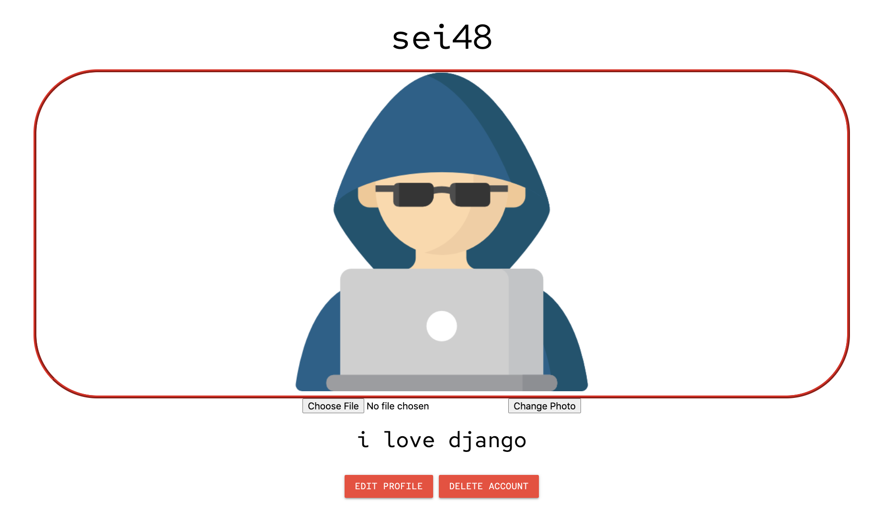
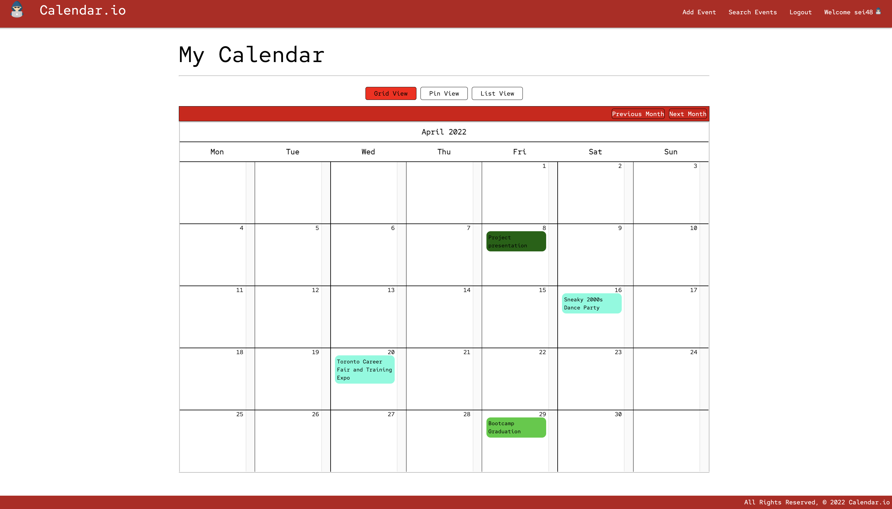
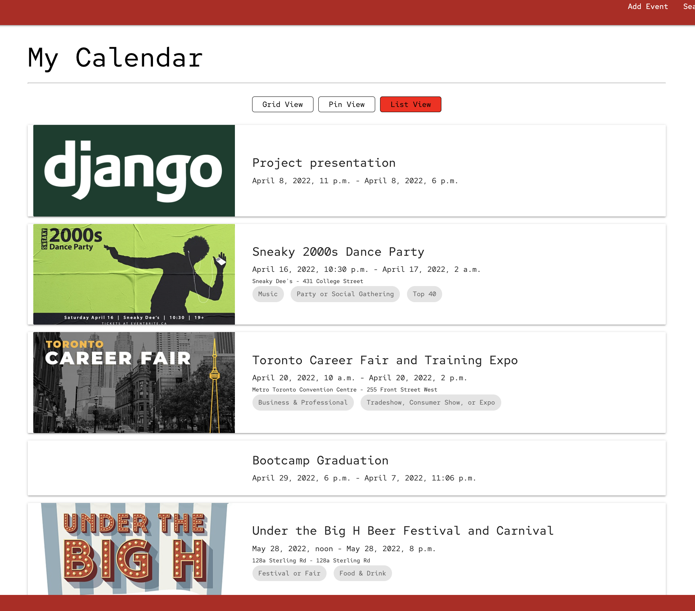
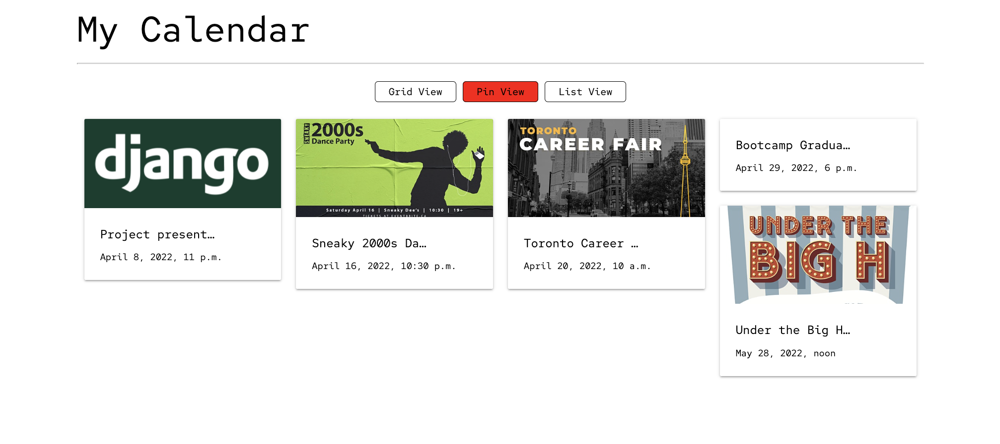
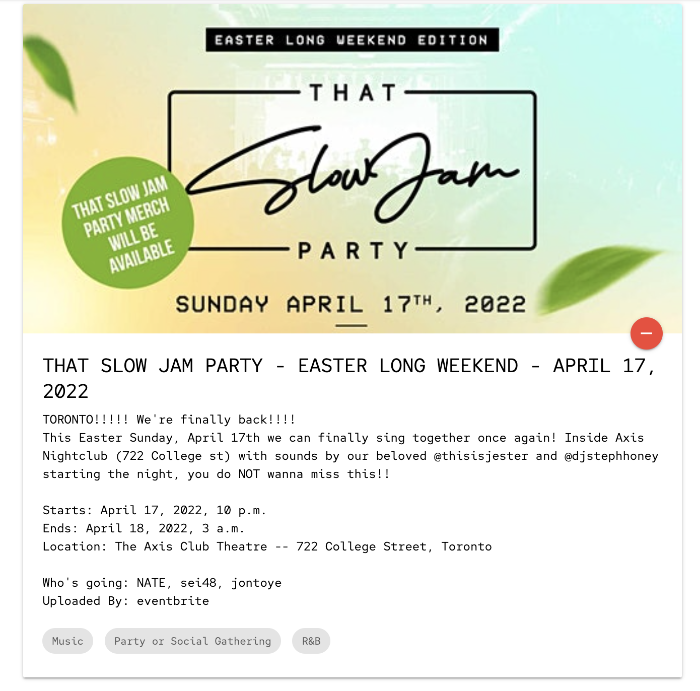
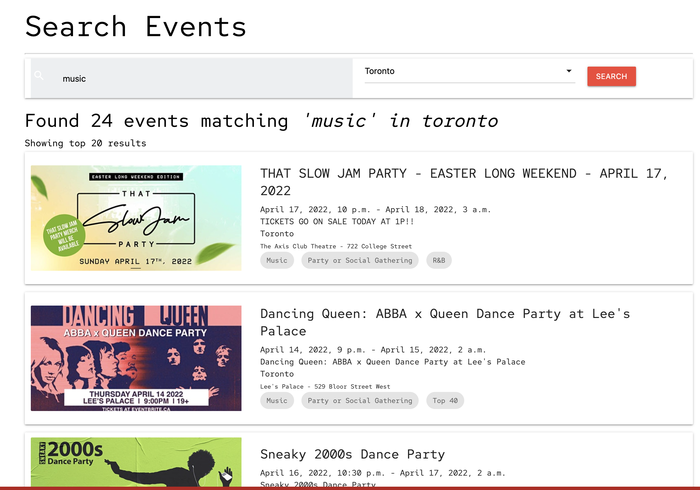

# Calender.io

## Getting Started

Calender.io is our solution to managing a busy schedule. Users can create their own custom events to keep track of, as well as search for nearby events that might be of interest.

See the [live demo here](https://event-calendar-sei48.herokuapp.com/)

To get started, users sign up for an account that can be customized with a profile photo and biography.

<small>Profile Screenshot</small>

 

## Creating an Event

To create an event, go to the 'Add Event' page and fill out the form provided. Custom events can be color coded to help categorize events on the grid view page. You may also attach a photo to the event to make it stand out.

<small>Grid View Screenshot</small>

## Viewing Your Events

Calender.io provides three main ways to view your events from your homepage: Grid View, Pin View, and List View. You can also view a list of all the events you have created and events you are attending from your profile page. 
Clicking on an event brings up that event's detail page. Each event may contain multiple 'tags' representing the categories this event falls under. Clicking on one of these tags will redirect you to the search page where all events containing that same tag will be displayed.

<small>List View Screenshot</small>

<small>Pin View Screenshot</small>

<small>Event Detail Screenshot</small>

 

## Searching for Events

Looking for something to do? Calender.io brings in real data from Eventbrite that you can search through using keywords and locations. Add and remove events as needed using the + and - buttons on the event detail page.

Search

 

## Technologies

This project was built with Django, PostgreSQL, and Materialize. 
Event data is being generated using an API from Eventbrite. 
Heroku was used for deployment. 

## Next Steps

Future releases of Calender.io will include:

<ul>
    <li>Ability to update the events you created</li>
    <li>Draggable tile cards on the pin view page so you can arrange the events however you like</li>
    <li>Improved date and time selection when creating an event</li>
    <li>Alowing users to leave comments/reviews on event detail pages</li>
    <li>Additional searching and sorting filters</li>
</ul>
